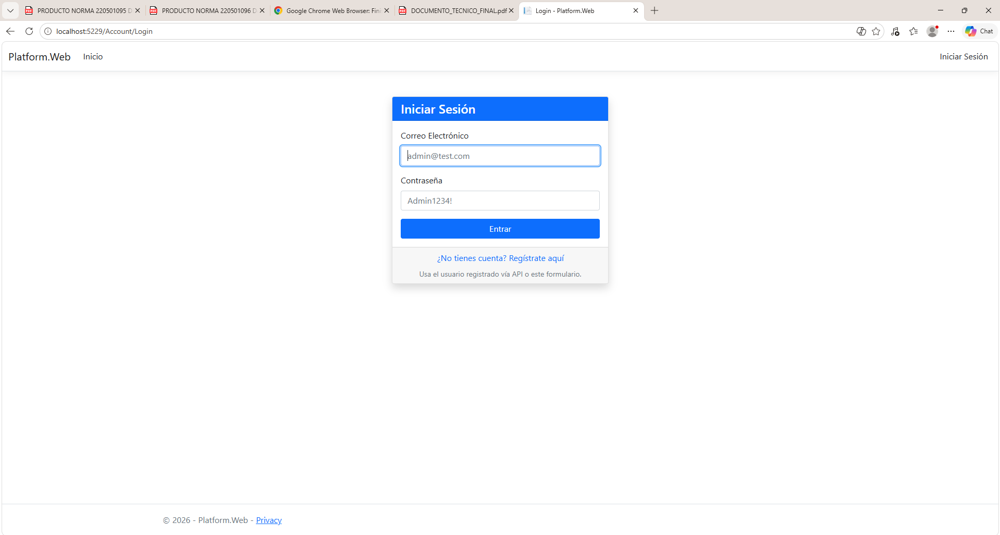
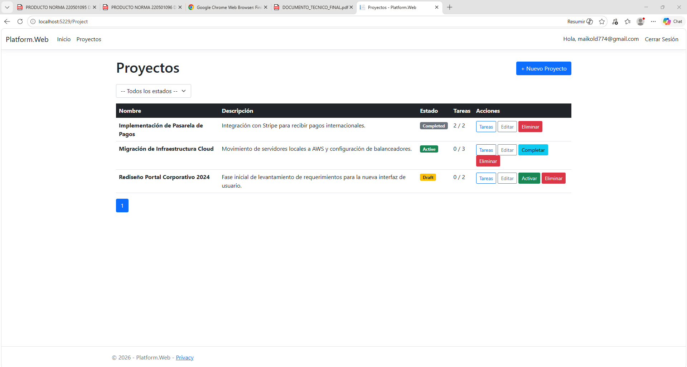
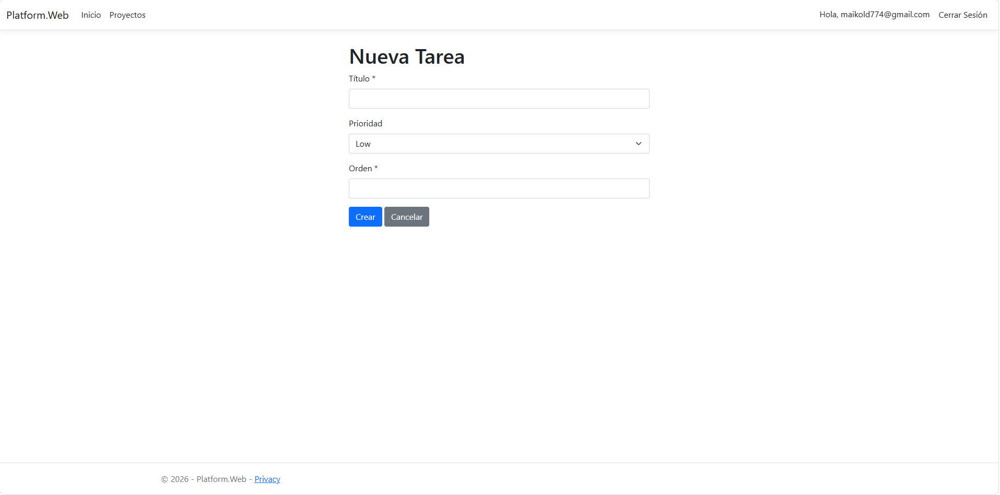
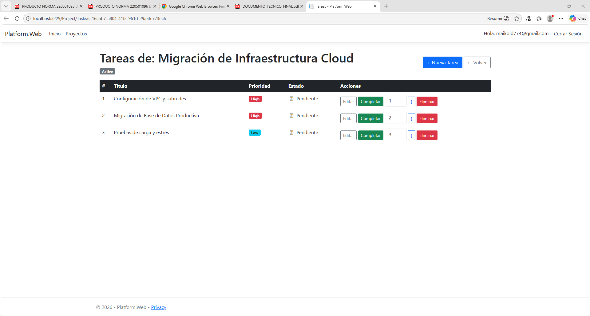

# Management Platform

Project and task management platform — Technical Assessment.

Architecture: **Clean Architecture** with .NET 8, PostgreSQL, Entity Framework Core, and JWT.

---

## Project Structure

```
Management_Platform.sln
├── Platform.Domain          # Entities, interfaces, and domain exceptions
├── Platform.Application     # DTOs, application services, and service interfaces
├── Platform.Infrastructure  # EF Core, repositories, AuthService, and migrations
├── Platform.Api             # REST API (ASP.NET Core + Swagger + JWT)
├── Platform.Web             # Web interface (ASP.NET Core MVC + Razor Views)
└── Platform.Tests           # Unit tests (xUnit)
```

---

## Getting Started (Docker - Recommended)

If you have Docker installed, you can run the entire stack (API, Web, and Database) with a single command. **This is the fastest way to get the project running on a new machine.**

1. **Clone the repository.**
2. **Run the services:**
   ```bash
   docker compose up -d --build
   ```
   *Note: The application will automatically apply database migrations on startup.*

The services will be available at:
- **API (Swagger):** [http://localhost:5294/swagger](http://localhost:5294/swagger)
- **Web MVC:** [http://localhost:5229](http://localhost:5229)
- **Postgres:** `localhost:5432`

---

## Manual Setup (Without Docker)

### Prerequisites

- [.NET 8 SDK](https://dotnet.microsoft.com/download/dotnet/8.0)
- [PostgreSQL 14+](https://www.postgresql.org/)
- (Optional) [pgAdmin](https://www.pgadmin.org/) to inspect the database

### Database Setup

1. Create a database in PostgreSQL:
   ```sql
   CREATE DATABASE management_platform;
   ```

2. Configure the connection string using **.NET User Secrets** for both `Platform.Api` and `Platform.Web`:

   From the project root, run:
   ```bash
   # For the API project
   dotnet user-secrets set "ConnectionStrings:DefaultConnection" "Host=localhost;Port=5432;Database=management_platform;Username=YOUR_USER;Password=YOUR_PASSWORD" --project Platform.Api

   # For the Web project
   dotnet user-secrets set "ConnectionStrings:DefaultConnection" "Host=localhost;Port=5432;Database=management_platform;Username=YOUR_USER;Password=YOUR_PASSWORD" --project Platform.Web
   ```

### Migrations

Apply the existing migrations from the project root:

```bash
dotnet ef database update --project Platform.Infrastructure --startup-project Platform.Api
```

### Running the Application

**REST API:**
```bash
dotnet run --project Platform.Api
```
Navigate to Swagger: `https://localhost:{port}/swagger`

**Web MVC:**
```bash
dotnet run --project Platform.Web
```
Navigate to: `https://localhost:{port}`

---

## Authentication (JWT)

The API is secured with JWT Bearer tokens. To authenticate:

1. **Register a user** — `POST /api/auth/register`
   ```json
   { "email": "admin@test.com", "password": "Admin1234!" }
   ```

2. **Login** — `POST /api/auth/login`
   ```json
   { "email": "admin@test.com", "password": "Admin1234!" }
   ```
   The response body contains the JWT access token.

3. In Swagger, click **"Authorize"** and enter: `Bearer {your_token}`

### Test Credentials

| Email | Password |
|---|---|
| `admin@test.com` | `Admin1234!` |

> You must register this user first via the `/api/auth/register` endpoint.

---

## Running Unit Tests

```bash
dotnet test Platform.Tests
```

**Covered test cases:**
- `ActivateProject_WithTasks_ShouldSucceed`
- `ActivateProject_WithoutTasks_ShouldFail`
- `CompleteProject_WithAllTasksCompleted_ShouldSucceed`
- `CompleteProject_WithPendingTasks_ShouldFail`
- `CreateTask_WithInvalidOrder_ShouldFail`
- `DeleteProject_ShouldBeDeletedWhenEntityRemoved`

---

## API Endpoints

| Method | Route | Description | Auth |
|---|---|---|---|
| POST | `/api/auth/register` | Register a new user | No |
| POST | `/api/auth/login` | Login and receive JWT token | No |
| GET | `/api/projects/search` | List projects (paginated, filterable) | Required |
| GET | `/api/projects/summary` | Global project and task counts | Required |
| POST | `/api/projects` | Create a project | Required |
| PUT | `/api/projects/{id}` | Update a project | Required |
| DELETE | `/api/projects/{id}` | Delete a project | Required |
| PATCH | `/api/projects/{id}/activate` | Activate a project | Required |
| PATCH | `/api/projects/{id}/complete` | Complete a project | Required |
| GET | `/api/projects/{id}/tasks` | List tasks for a project | Required |
| POST | `/api/tasks/{projectId}` | Create a task | Required |
| PUT | `/api/tasks/{id}` | Update a task | Required |
| DELETE | `/api/tasks/{id}` | Delete a task | Required |
| PATCH | `/api/tasks/{id}/complete` | Mark a task as completed | Required |
| PATCH | `/api/tasks/{id}/reorder` | Change the order of a task | Required |

---

## System Screenshots

*(Below are placeholders to insert system screenshots once the application is running)*

### Login Page
>  - Secure credentials entry.

### Projects Dashboard
>  - General list with statuses (Draft, Active, Completed).

### Task Management
>  - Creation form  
>  - Task list with hierarchical order.
---

## Technologies

- **Backend**: ASP.NET Core 8
- **ORM**: Entity Framework Core 8
- **Containerization**: Docker & Docker Compose
- **Database**: PostgreSQL (via Npgsql)
- **Authentication**: JWT (System.IdentityModel.Tokens.Jwt)
- **Password Hashing**: BCrypt.Net-Next
- **API Documentation**: Swagger / Swashbuckle
- **Testing**: xUnit + Moq
