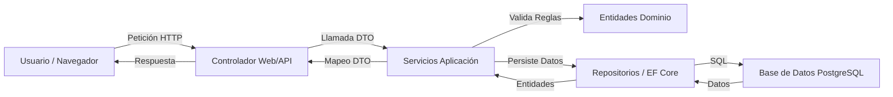

# Documento Técnico - Management Platform

## 1. Estructura del Proyecto
El sistema está desarrollado bajo el patrón **Clean Architecture**, dividiendo la lógica en 4 capas principales para asegurar mantenibilidad y escalabilidad:

*   **Domain (Núcleo)**: Contiene las entidades (`Project`, `TaskItem`), enumeraciones y excepciones de negocio. No tiene dependencias externas.
*   **Application**: Orquesta la lógica de negocio mediante servicios (`ProjectService`, `TaskService`) y define los DTOs para el intercambio de datos.
*   **Infrastructure**: Implementa el acceso a datos con **EF Core + PostgreSQL**, la seguridad con **JWT/Cookies** y el patrón Repositorio.
*   **API / Web**: Capas de presentación que exponen los servicios mediante una interfaz RESTful y una aplicación Web MVC.

## 2. Descripción de Carpetas y Módulos
*   `Platform.Domain/Entities`: Modelos de datos fundamentales.
*   `Platform.Application/DTOs`: Objetos de transferencia de datos.
*   `Platform.Infrastructure/Data`: Configuración de base de datos y migraciones.
*   `Platform.Api/Controllers`: Manejo de endpoints para integraciones externas.
*   `Platform.Web/Views`: Interfaz de usuario basada en Razor.

## 3. Flujo del Sistema
El flujo de información sigue un camino unidireccional para peticiones y respuestas:



1.  **Entrada**: El usuario realiza una acción en `Platform.Web` (ej: Crear Tarea).
2.  **Controlador**: El `TaskController` recibe la petición y valida el estado de autenticación.
3.  **Servicio**: Se llama al `TaskService` en la capa de Aplicación.
4.  **Dominio**: El servicio interactúa con la entidad `Project` para validar reglas de negocio (ej: ¿el proyecto está activo?).
5.  **Persistencia**: Se utiliza el `UnitOfWork` para guardar los cambios en PostgreSQL mediante `EF Core`.
6.  **Salida**: El sistema redirige al usuario a la vista actualizada con un mensaje de éxito.

## 4. Fragmentos de Código Relevantes
### Regla de Negocio: Activación de Proyecto
```csharp
// Valida que no se activen proyectos sin tareas (Requisito de la Norma)
public void Activate(int taskCount)
{
    if (taskCount == 0)
        throw new DomainException("El proyecto debe tener al menos una tarea.");

    Status = ProjectStatus.Active;
}
```

### Hash de Contraseñas (Seguridad)
```csharp
// Uso de BCrypt para asegurar que las contraseñas no se guarden en texto plano
public async Task RegisterAsync(string email, string password)
{
    var passwordHash = BCrypt.Net.BCrypt.HashPassword(password);
    var user = new User(email, passwordHash);
    await _uow.Users.AddAsync(user);
}
```

## 5. Tecnologías Usadas
*   **.NET 8**: Framework principal.
*   **PostgreSQL**: Motor de base de datos relacional.
*   **Entity Framework Core**: ORM para mapeo de datos.
*   **JWT & Cookies**: Mecanismos de autenticación.
*   **xUnit & Moq**: Pruebas unitarias.
